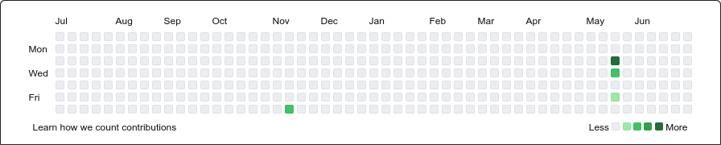

# Welcome to FerShibli's Repository

## About Me

Hello, fellow developers! Welcome to my GitHub front page. I'm FerShibli, a passionate fullstack developer and tech enthusiast from Brazil. Here, you'll find a collection of projects, ideas, and experiments that I've been working on. My main areas of interest include web development, software engineering, and exploring new technologies.

## Contact Me

Feel free to reach out to me if you have any questions, suggestions, or just want to say hi. You can find me on the following platforms:

- [📧 Email](mailto:fernandoluiz.1991@gmail.com)
- [💼 LinkedIn](https://bit.ly/in-fershibli)
- [🐦 Twitter](https://twitter.com/fershibli)
- [🟦 BlueSky](https://bsky.app/profile/fershibli.bsky.social)
- [📸 Instagram](https://www.instagram.com/fershibli)

## GitHub Verdinho Mission

GitHub Verdinho Mission is my personal adventure with the goal of filling up the GitHub activity chart for the upcoming year! The mission started on July 2nd, and I'm excited to embark on this journey of continuous contribution and growth.

> My aim is to actively contribute to open-source projects, personal projects, and any other meaningful repositories to keep my GitHub activity chart "verdinho" (_Portuguese for "green," representing daily activity_). Through consistent commits and valuable contributions, I hope to create a vibrant and active GitHub profile.

For the record, it started like this:

I'm open to collaborating with other developers and projects that align with my interests, and I'm eager to support initiatives that promote inclusivity, diversity, and positive change in the tech community.

Feel free to explore the repositories, follow my progress, and join me on this exciting GitHub Verdinho adventure!

🌱 Let's make the GitHub chart greener together! 🌱

## Support

If you find any of my projects helpful or interesting, please consider giving them a ⭐️. It's a great way to show your support and encouragement.

Thank you for visiting my GitHub front page. Happy coding!
